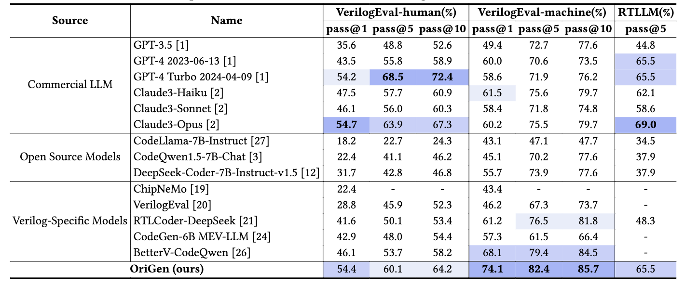

# OriGen: Enhancing RTL Code Generation with Code-to-Code Augmentation and Self-Reflection

### Introduction
OriGen is a fine-tuned lora model designed for Verilog code generation. It is trained on top of DeepSeek Coder 7B using datasets generated from code-to-code augmentation and self-reflection.

The model has been uploaded to Hugging Face, and the repository contains the inference scripts. The dataset and data generation flow will be released soon.

- **Huggingface**: https://huggingface.co/henryen/OriGen
- **Repository**: https://github.com/pku-liang/OriGen

### Evaluation Results


### Quick Start

Before running the following code, please install the required packages:

```bash
conda create -n origen python=3.11
conda activate origen
pip install -r requirements.txt
```

Here is an example of how to use the model. Please note that the base model, DeepSeek Coder 7B, is loaded in float16 precision though the its default precision is bfloat16.

The reason for this is that we find Lora trained in float16 performs better than that in bfloat16 in experiments.

```python
from transformers import AutoModelForCausalLM, AutoTokenizer, TextStreamer
import torch
from peft import PeftModel

model_name = "deepseek-ai/deepseek-coder-7b-instruct-v1.5"

tokenizer = AutoTokenizer.from_pretrained(model_name)

model = AutoModelForCausalLM.from_pretrained(
    model_name,
    low_cpu_mem_usage=True,
    torch_dtype=torch.float16,
    attn_implementation="flash_attention_2",
    device_map="auto",
)

model = PeftModel.from_pretrained(model, model_id="henryen/OriGen")
model.eval()

streamer = TextStreamer(tokenizer, skip_prompt=True, skip_special_tokens=True)

prompt = "### Instruction: Please act as a professional Verilog designer. and provide Verilog code based on the given instruction. Generate a concise Verilog module for a 8 bit full adder, don't include any unnecessary code.\n### Response: "

inputs = tokenizer(prompt, return_tensors="pt").to("cuda")

outputs = model.generate(
    **inputs, 
    max_new_tokens=1000, 
    do_sample=False, 
    eos_token_id=tokenizer.eos_token_id,
    pad_token_id=tokenizer.pad_token_id,
    streamer=streamer
)
```

The output will be:
```verilog
module full_adder(
    input [7:0] a,
    input [7:0] b,
    input cin,
    output [7:0] sum,
    output cout
);

assign {cout, sum} = a + b + cin;

endmodule
```

### Verilog-Eval Benchmark
We have released the scripts for the Verilog-Eval benchmark. Please refer to the [README](./evaluation/README.md) for details.


### Paper
**Arxiv:** https://arxiv.org/abs/2407.16237

Please cite our paper if you use this model.

```
@article{2024origen,
  title={OriGen: Enhancing RTL Code Generation with Code-to-Code Augmentation and Self-Reflection},
  author={Cui, Fan and Yin, Chenyang and Zhou, Kexing and Xiao, Youwei and Sun, Guangyu and Xu, Qiang and Guo, Qipeng and Song, Demin and Lin, Dahua and Zhang, Xingcheng and others},
  journal={arXiv preprint arXiv:2407.16237},
  year={2024}
}
```
